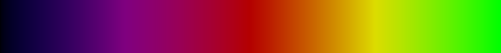
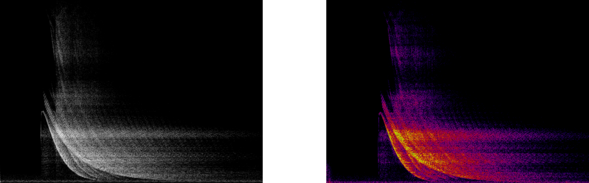

# Visualizing Sound as an Audio Spectrogram

Share image data between vDSP and vImage to visualize audio that a device microphone captures.

## Overview

This sample code project captures audio from a macOS or iOS device's microphone and uses a combination of routines from vImage and vDSP to render the audio as an _audio spectrogram_. Audio spectrograms visualize audio in 2D using one axis to represent time and the other axis to represent frequency. Color represents the amplitude of the time-frequency pair. 

Audio spectrograms have applications in signal analysis. For example, a spectrogram can help identify audio issues, such as low- or high-frequency noise, or short-impulse noises like clicks and pops, that may not be immediately obvious to the human ear. Spectrograms can also assist in audio classification using neural networks in applications, such as bird song and speech recognition.

The image below shows the audio spectrogram that this sample created from [GarageBand](https://www.apple.com/ios/garageband/)'s _Stargate Opening_ sound effect. The horizontal axis represents time, and the vertical axis represents frequency. The sample calculates the color that represents amplitude using procedurally generated false-color lookup tables.


The sample creates an audio spectrogram by performing a discrete cosine transform (DCT) on audio samples. The DCT computes the frequency components of an audio signal and represents the audio as a series of amplitudes at the component frequencies. DCTs are related to Fourier transforms, but use real values rather than complex values. You can learn more about Fourier transforms at [_Finding the Component Frequencies in a Composite Sine Wave_](https://developer.apple.com/documentation/accelerate/finding_the_component_frequencies_in_a_composite_sine_wave).

The spectrogram scrolls horizontally so that the most recent sample renders on the right side of the device's screen.

For each sample buffer that AVFoundation provides, the app appends that data to the `rawAudioData` array.  At the same time, the app applies a DCT to the first `sampleCount` elements of `rawAudioData` and produces a single-precision frequency-domain representation. 

The code appends the newly generated frequency-domain values to `frequencyDomainValues` and discards `sampleCount` elements from the beginning. It is this appending and discarding of data that generates the scrolling effect.

A vImage buffer, `planarImageBuffer`, shares data with `frequencyDomainValues` and the code uses this as a planar source to populate an interleaved ARGB vImage buffer, `rgbImageBuffer`. Lookup tables colorize `rgbImageBuffer`, and the app rotates the RGB image buffer, writing the result to  `rotatedImageBuffer`, to display the image in the user interface.

Before exploring the code, build and run the app to familiarize yourself with the different visual results the app generates from different sounds.

Note that because Xcode doesn’t have access to the device microphone, this sample won’t work in Simulator.

## Define the Spectrogram Size

The sample defines two constants that specify the size of the spectrogram:

* `sampleCount` defines the number of individual samples that pass to the DCT, and the resolution of the displayed frequencies. 
* `bufferCount` controls the number of displayed buffers. 

The sample also specifies a hop size that controls the overlap between frames of data and ensures that the spectrogram doesn't lose any audio information at the start and end of each sample: 

``` swift
/// Samples per frame — the height of the spectrogram.
static let sampleCount = 1024

/// Number of displayed buffers — the width of the spectrogram.
static let bufferCount = 768

/// Determines the overlap between frames.
static let hopCount = 512
```

The app displays the spectrogram in a [`CALayer`](https://developer.apple.com/documentation/quartzcore/calayer) with its [`contentsGravity`](https://developer.apple.com/documentation/quartzcore/calayer/1410872-contentsgravity) set to [`resize`](https://developer.apple.com/documentation/quartzcore/calayercontentsgravity/1410811-resize) so that the rendered image conforms to the device's screen proportions.

## Configure the Capture Session

The sample configures the [`AVCaptureSession`](https://developer.apple.com/documentation/avfoundation/avcapturesession) instance between calls to [`beginConfiguration`](https://developer.apple.com/documentation/avfoundation/avcapturesession/1389174-beginconfiguration) and [`commitConfiguration`](https://developer.apple.com/documentation/avfoundation/avcapturesession/1388173-commitconfiguration). 

The following code attaches the device's built-in microphone to the capture session:

``` swift
guard
    let microphone = AVCaptureDevice.default(.builtInMicrophone,
                                             for: .audio,
                                             position: .unspecified),
    let microphoneInput = try? AVCaptureDeviceInput(device: microphone) else {
        fatalError("Can't create microphone.")
}

if captureSession.canAddInput(microphoneInput) {
    captureSession.addInput(microphoneInput)
}
```

After adding an [`AVCaptureAudioDataOutput`](https://developer.apple.com/documentation/avfoundation/avcaptureaudiodataoutput) instance to the capture session and specifying the sample buffer delegate, the app is ready to capture and process audio buffer samples. The sample calls [`startRunning()`](https://developer.apple.com/documentation/avfoundation/avcapturesession/1388185-startrunning) on the capture session to start the flow of data from the microphone inputs to the output:

``` swift
self.captureSession.startRunning()
```

## Capture the Audio

For each captured audio sample buffer, AVFoundation calls [`captureOutput(_:didOutput:from:)`](https://developer.apple.com/documentation/avfoundation/avcaptureaudiodataoutputsamplebufferdelegate/1386039-captureoutput).

The following code uses [`CMSampleBufferGetAudioBufferListWithRetainedBlockBuffer`](https://developer.apple.com/documentation/coremedia/1489191-cmsamplebuffergetaudiobufferlist) to acquire the data:

``` swift
var audioBufferList = AudioBufferList()
var blockBuffer: CMBlockBuffer?

CMSampleBufferGetAudioBufferListWithRetainedBlockBuffer(
    sampleBuffer,
    bufferListSizeNeededOut: nil,
    bufferListOut: &audioBufferList,
    bufferListSize: MemoryLayout.stride(ofValue: audioBufferList),
    blockBufferAllocator: nil,
    blockBufferMemoryAllocator: nil,
    flags: kCMSampleBufferFlag_AudioBufferList_Assure16ByteAlignment,
    blockBufferOut: &blockBuffer)

guard let data = audioBufferList.mBuffers.mData else {
    return
}
```

On return, `data` is a pointer to the raw audio data.

Because the audio spectrogram code requires exactly `sampleCount` (which the app defines as 1024) samples, but audio sample buffers from AVFoundation may not always contain exactly 1024 samples, the app adds the contents of each audio sample buffer to `rawAudioData`. The following code creates an array from `data` and appends it to  `rawAudioData`:

``` swift
let actualSampleCount = CMSampleBufferGetNumSamples(sampleBuffer)

let ptr = data.bindMemory(to: Int16.self, capacity: actualSampleCount)
let buf = UnsafeBufferPointer(start: ptr, count: actualSampleCount)

rawAudioData.append(contentsOf: Array(buf))
```

After appending the data, the app passes the first `sampleCount` of raw audio data to the `processData(values:)` function, and removes the first `hopCount` elements from  `rawAudioData`. By removing fewer elements than each step processes, the rendered frames of data overlap, ensuring no loss of audio data:

``` swift
while self.rawAudioData.count >= AudioSpectrogram.sampleCount {
    let dataToProcess = Array(self.rawAudioData[0 ..< AudioSpectrogram.sampleCount])
    self.rawAudioData.removeFirst(AudioSpectrogram.hopCount)
    self.processData(values: dataToProcess)
}

createAudioSpectrogram()
```

## Process the Audio Data 

The `processData(values:)` function processes the first `sampleCount` samples from  `rawAudioData` by performing the DCT and appending the frequency-domain representation data to the array that creates the vImage buffer and, ultimately, the audio spectrogram image.

To avoid recreating working arrays with each iteration, the following code creates reusable buffers that  `processData(values:)` uses:

``` swift
/// A reusable array that contains the current frame of time domain audio data as single-precision
/// values.
var timeDomainBuffer = [Float](repeating: 0,
                               count: sampleCount)

/// A resuable array that contains the frequency domain representation of the current frame of
/// audio data.
var frequencyDomainBuffer = [Float](repeating: 0,
                                    count: sampleCount)
```

The sample calls [`integerToFloatingPoint(_:floatingPointType:)`](https://developer.apple.com/documentation/accelerate/vdsp/3240989-integertofloatingpoint) to convert 16-bit integer audio samples to single-precision floating-point values:

``` swift
vDSP.convertElements(of: values,
                     to: &timeDomainBuffer)
```

To reduce spectral leakage, the sample multiplies the signal by a Hann window and performs the DCT. The following code generates the window:

``` swift
let hanningWindow = vDSP.window(ofType: Float.self,
                                usingSequence: .hanningDenormalized,
                                count: sampleCount,
                                isHalfWindow: false)
```

To learn more about using windows to reduce spectral leakage, see [_Using Windowing with Discrete Fourier Transforms_](https://developer.apple.com/documentation/accelerate/using_windowing_with_discrete_fourier_transforms).

The following code multiplies the time-domain data by the Hann window and performs the forward DCT:

``` swift
vDSP.multiply(timeDomainBuffer,
              hanningWindow,
              result: &timeDomainBuffer)

forwardDCT.transform(timeDomainBuffer,
                     result: &frequencyDomainBuffer)
```

After the sample performs the forward transform, it converts the frequency-domain values to decibels so that the spectrogram colors are roughly proportional to perceived loudness:

``` swift
vDSP.absolute(frequencyDomainBuffer,
              result: &frequencyDomainBuffer)

vDSP.convert(amplitude: frequencyDomainBuffer,
             toDecibels: &frequencyDomainBuffer,
             zeroReference: Float(AudioSpectrogram.sampleCount))
```

## Define the False-Color Lookup Tables

The following function creates the values for the lookup tables that the sample uses to create the false-color rendering. The function returns dark blue for low values, graduates through red, and returns full-brightness green for `255`:

``` swift
#if os(iOS)
typealias Color = UIColor
#else
typealias Color = NSColor
#endif

static func brgValue(from value: Pixel_8) -> (red: Pixel_8,
                                              green: Pixel_8,
                                              blue: Pixel_8) {
    let normalizedValue = CGFloat(value) / 255
    
    // Define `hue` that's blue at `0.0` to red at `1.0`.
    let hue = 0.6666 - (0.6666 * normalizedValue)
    let brightness = sqrt(normalizedValue)

    let color = Color(hue: hue,
                      saturation: 1,
                      brightness: brightness,
                      alpha: 1)
    
    var red = CGFloat()
    var green = CGFloat()
    var blue = CGFloat()
    
    color.getRed(&red,
                 green: &green,
                 blue: &blue,
                 alpha: nil)
    
    return (Pixel_8(green * 255),
            Pixel_8(red * 255),
            Pixel_8(blue * 255))
}
```

The following image shows the color that the function returns with inputs from `0` through `255`:



The sample calls the `static AudioSpectrogram.brgValue(from:)` function to populate lookup tables for the red, green, and blue channels. Because the final output is 8 bits per channel, the lookup tables each contain 256 [`Pixel_8`](https://developer.apple.com/documentation/accelerate/pixel_8) values:

``` swift
static var redTable: [Pixel_8] = (0 ... 255).map {
    return brgValue(from: $0).red
}

static var greenTable: [Pixel_8] = (0 ... 255).map {
    return brgValue(from: $0).green
}

static var blueTable: [Pixel_8] = (0 ... 255).map {
    return brgValue(from: $0).blue
}
```

## Prepare the vImage Buffers to Display the Audio Spectrogram

The app uses two vImage buffers to store and display the audio spectrogram: 

* A working buffer that's `sampleCount` wide by  `bufferCount` high, and allows the code to easily add and remove `sampleCount` elements.
* A buffer for displaying the spectrogram that's `bufferCount` wide by `sampleCount` high, and allows for the horizontal rending and scrolling of the spectrogram.

The following code creates a Core Graphics image format structure that describes the output image: 

``` swift
var rgbImageFormat: vImage_CGImageFormat = {
    guard let format = vImage_CGImageFormat(
            bitsPerComponent: 8,
            bitsPerPixel: 8 * 4,
            colorSpace: CGColorSpaceCreateDeviceRGB(),
            bitmapInfo: CGBitmapInfo(rawValue: CGImageAlphaInfo.first.rawValue),
            renderingIntent: .defaultIntent) else {
        fatalError("Can't create image format.")
    }
    
    return format
}()
```

The sample uses the Core Graphics image format to initialize two buffers that contain the audio spectrogram. `rgbImageBuffer` is the internal, vertically oriented representation, and `rotatedImageBuffer` is the horizontally oriented representation that displays in the user interface:

``` swift
/// RGB vImage buffer that contains a vertical representation of the audio spectrogram.
lazy var rgbImageBuffer: vImage_Buffer = {
    guard let buffer = try? vImage_Buffer(width: AudioSpectrogram.sampleCount,
                                          height: AudioSpectrogram.bufferCount,
                                          bitsPerPixel: rgbImageFormat.bitsPerPixel) else {
        fatalError("Unable to initialize image buffer.")
    }
    return buffer
}()

/// RGB vImage buffer that contains a horizontal representation of the audio spectrogram.
lazy var rotatedImageBuffer: vImage_Buffer = {
    guard let buffer = try? vImage_Buffer(width: AudioSpectrogram.bufferCount,
                                          height: AudioSpectrogram.sampleCount,
                                          bitsPerPixel: rgbImageFormat.bitsPerPixel)  else {
        fatalError("Unable to initialize rotated image buffer.")
    }
    return buffer
}()
```

## Create the Audio Spectrogram

The [`vImageConvert_PlanarFToARGB8888`](https://developer.apple.com/documentation/accelerate/1533216-vimageconvert_planarftoargb8888) function populates an unsigned 8-bit integer interleaved vImage buffer with the single-precision frequency-domain values. 

For the color channels, the sample specifies the minimum as `0` and the maximum as the maximum possible value in `rawAudioData` converted to decibels. For the alpha channel, set the maximum and minimum values to `1.0`. When `vImageConvert_PlanarFToARGB8888` receives the same value for maximum and minimum, it treats that value as a constant. Note that the function requires a valid `vImage_Buffer` pointer for that channel, but the values in that buffer are unimportant:

``` swift
let maxFloats: [Float] = [255, maxFloat, maxFloat, maxFloat]
let minFloats: [Float] = [255, 0, 0, 0]

frequencyDomainValues.withUnsafeMutableBufferPointer {
    var planarImageBuffer = vImage_Buffer(data: $0.baseAddress!,
                                          height: vImagePixelCount(AudioSpectrogram.bufferCount),
                                          width: vImagePixelCount(AudioSpectrogram.sampleCount),
                                          rowBytes: AudioSpectrogram.sampleCount * MemoryLayout<Float>.stride)
    
    vImageConvert_PlanarFToARGB8888(&planarImageBuffer,
                                    &planarImageBuffer, &planarImageBuffer, &planarImageBuffer,
                                    &rgbImageBuffer,
                                    maxFloats, minFloats,
                                    vImage_Flags(kvImageNoFlags))
}
```

The following code transforms the color buffer using the lookup tables:

``` swift
vImageTableLookUp_ARGB8888(&rgbImageBuffer, &rgbImageBuffer,
                           nil,
                           &AudioSpectrogram.redTable,
                           &AudioSpectrogram.greenTable,
                           &AudioSpectrogram.blueTable,
                           vImage_Flags(kvImageNoFlags))
```

The image below shows the audio spectrogram of GarageBand's _Pitch Fall_ sound effect before and after applying the lookup table transform:



The sample rotates the color buffer by 90º so that the audio spectrogram scrolls horizontally:

``` swift
vImageRotate90_ARGB8888(&rgbImageBuffer,
                        &rotatedImageBuffer,
                        UInt8(kRotate90DegreesCounterClockwise),
                        [UInt8()],
                        vImage_Flags(kvImageNoFlags))
```
